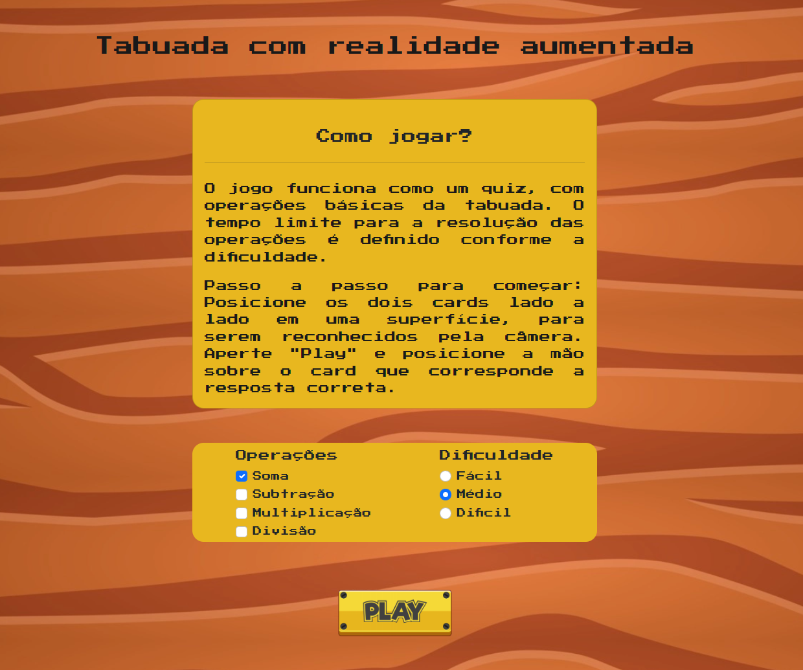

    <h1>Tabuada com realidade aumentada</h1>

  

## Sobre

O jogo funciona como um quiz, com operações básicas da tabuada. O tempo limite para a resolução das operações é definido conforme a dificuldade escolhida.

## Tecnologias utilizadas

* Aframe 0.1.3
* Express 4.18.1
* Bootstrap 5.2.2

## Link da aplicação

[tabuada-ra-davirsreis.vercel.app/](https://tabuada-ra-davirsreis.vercel.app/)

## Para executar

1. `git clone https://github.com/davirsreis/tabuadaRA.git`
2. `cd tabuadaRA`
3. `npm install express@4.18.1`
4. `node app`

## Instruções

1. Baixe os marcadores disponíveis em tabuadaRA/public/img/marcadores tabuada-ra.png
2. Acesse o link ou rode a aplicação
3. Escolha as operações e a dificuldade que deseja e aperte em "Start"
4. Permita o acesso a câmera, e aponte aos marcadores
5. Posicione a mão sobre o marcador que corresponde a resposta correta
